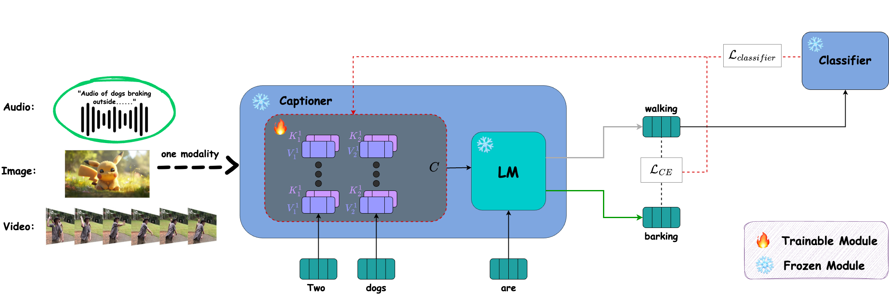

# Classifier-Guided-Captioning-Across-Modalities
Official implementation of the paper "Classifier-Guided Captioning Across Modalities" [ICASSP 2025]

<p align="center">

<a href="https://arielshaulov.github.io/Classifier-Guided-Captioning-Across-Modalities/"></a> 
 <a href="https://arxiv.org/abs/2501.03183"></a>

> Most current captioning systems use language models trained on data from specific settings, such as image-based captioning via Amazon Mechanical Turk, limiting their ability to generalize to other modality distributions and contexts. This limitation hinders performance in tasks like audio or video captioning, where different semantic cues are needed. Addressing this challenge is crucial for creating more adaptable and versatile captioning frameworks applicable across diverse real-world contexts. In this work, we introduce a method to adapt captioning networks to the semantics of alternative settings, such as capturing audibility in audio captioning, where it is crucial to describe sounds and their sources. Our framework consists of two main components: (i) a frozen captioning system incorporating a language model (LM), and (ii) a text classifier that guides the captioning system. The classifier is trained on a dataset automatically generated by GPT-4, using tailored prompts specifically designed to enhance key aspects of the generated captions. Importantly, the framework operates solely during inference, eliminating the need for further training of the underlying captioning model. We evaluate the framework on various models and modalities, with a focus on audio captioning, and report promising results. Notably, when combined with an existing zero-shot audio captioning system, our framework improves its quality and sets state-of-the-art performance in zero-shot audio captioning.

## Description  
Official implementation of the paper "Classifier-Guided Captioning Across Modalities" [ICASSP 2025]
 <br>

## Audibility Dataset
For the full dataset please checkout: [Audibility Dataset](https://github.com/arielshaulov/zero-shot-audio-captioning/tree/main/audibility-dataset)


## Overview Of Our Method
<p align="center">
  
<br>
An overview of our modality-agnostic approach is depicted, with a focus on audio captioning during inference. In this illustration, the audio modality is
highlighted (enclosed in a green circle), where the captioner functions as an audio captioner, and the classifier is an audibility classifier (which was pre-trained
on our audibility dataset. The model is guided to generate the phrase ’barking’ instead of ’walking’ by adjusting the context (C) using the
gradients from the classifier loss L_classifier, as indicated by the red arrow. To maintain the inherent characteristics of the language model, the minimum
divergence from the original distribution is optimized using the cross-entropy loss L_ce.
</p>

## Citing our paper
If you make use of our work, please cite our paper:
```
@article{shaulov2025classifier,
  title={Classifier-Guided Captioning Across Modalities},
  author={Shaulov, Ariel and Shaharabany, Tal and Shaar, Eitan and Chechik, Gal and Wolf, Lior},
  journal={arXiv preprint arXiv:2501.03183},
  year={2025}
}
